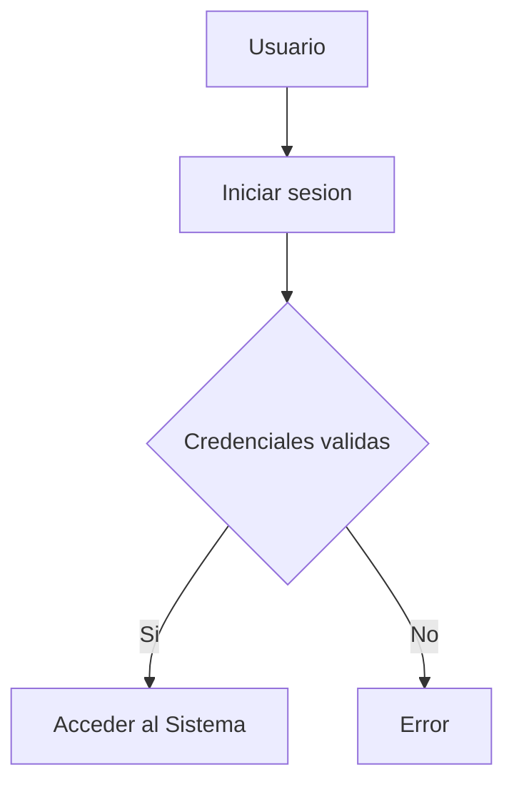

# Titulo importante
Me encuentro aprendineod "Markdown" en la clase del profesor Pallin..
## Subtitulo 01
Aqui verificamos como formatear diferentes **tipos de texto**.
## Subtitulo 02
Podremos conocer diferentes tipo de formatos de textos usando ~~Markdown~~

### Creando Hiperv...
[Google](https://www.google.com/?hl=es)
[Tecsup](https://www.tecsup.edu.pe/)

## Colocar imagenes


## Funciones
- [X] Registrar Alumno
- [X] Generar Matricula
- [ ] Campo vacio
- [ ] Libre

## Creando Tablas

|Lenguaje de Programacion| Creador |
| -----------------------| ------- |
| Java | James Cosling |
| PHP  | Rasmus Lerdor |
|Python | Guido Van Rossum |

## Codigo

```html

<h1>Hola Mundo <h1>

```

```css
body{
    bakcground:"red";
}
```
```java
public class main{
    public staticn void main(String[] args){
        System.out.println("Hola mundo java");
    }

}
```

## Diagrama de flujo Mermaid

